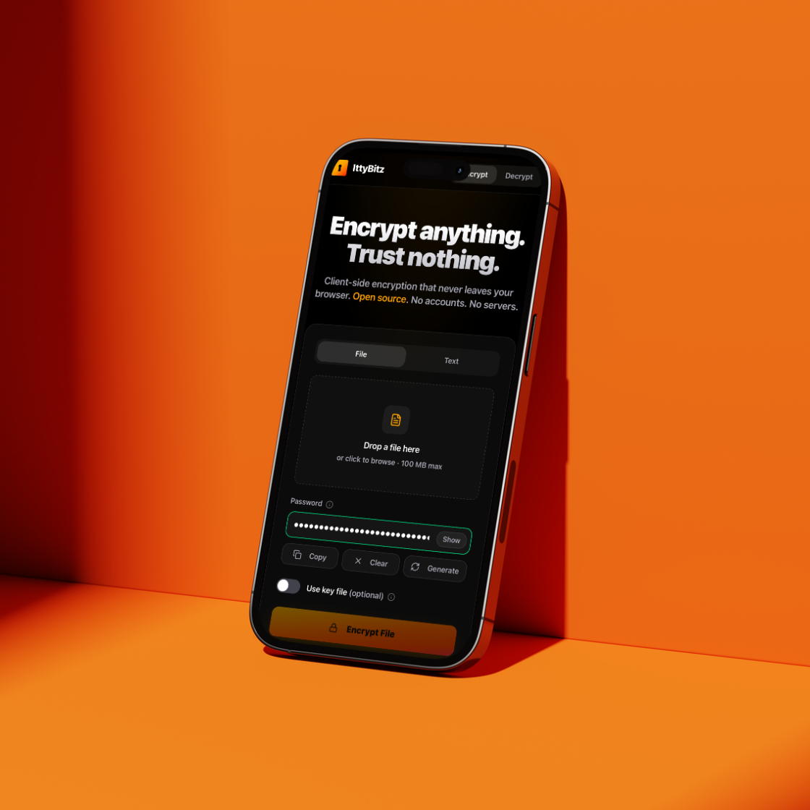

# 🔒 IttyBitz

<br/>

**Tired of worrying where your private files and notes end up?**

With this client-side encryption tool, you can lock down your sensitive information right in your browser—nothing ever leaves your device. 
Whether you’re protecting confidential work documents before sharing them, or storing personal notes you don’t want synced to the cloud, this tool makes security effortless.

IttyBitz offers a secure and private way to encrypt sensitive information directly in your browser without ever sending it to a server.

<p align=center>

</p>

<br/>

## ⚙️ Core features

Here’s what you can do with IttyBitz:
- **Client-side encryption/decryption**: all cryptographic operations happen in your browser. Your files and secrets are never sent to a server.
- **Password & key file protection**: secure your data with a strong password, an optional key file, or both for an added layer of security. You can use any existing file or generate a new, cryptographically secure key file directly within the app.
- **File & text support**: encrypt and decrypt both files and text snippets.
- **QR Code Sharing**: easily share encrypted text snippets via a downloadable QR code.
- **No accounts required**: works entirely without user accounts or signins.

<br/>

## 🥤 How to Use IttyBitz

At the top, you’ll find two simple tabs:  **Encrypt 🔒**  and **Decrypt 🔑**

- In **Encrypt** mode, you can lock away a file or a text snippet with a password, a key file, or both.

| Encrypting a file | Encrypting text |
|---	|---	|
|	1.	Select the Encrypt tab.|	1.	Select the Encrypt tab.|   	
|	2.	Ensure the File option is selected.	|	2.	Choose the Text option.|
|	3.	Upload the file you wish to encrypt.|	3.	Enter your text in the provided box.|
|	4.	Enter a strong password. For extra security, toggle "Use Key File" to either select an existing file or generate and download a new one. |	4.	Enter a password. For extra security, toggle "Use Key File" to add a key file.|
|	5.	Click Encrypt and download the encrypted file for safekeeping.|	5.	After encrypting, you can copy the text, or click the **QR code icon** to view and download the encrypted output as a PNG file for easy, secure sharing.|

- In **Decrypt** mode, you simply unlock your protected content and get it back instantly—only if you hold the right key.

| Decrypting a file | Decrypting a text |
|---	|---	|
|	1.	Select the Decrypt tab.|	1.	Select the Decrypt tab.|   	
|	2.	Ensure the File option is selected.|	2.	Choose the Text option.|
|	3.	Upload the encrypted file.|		3.	Paste your encrypted text into the box.|
|	4.	Enter the same password (and the key file, if used) and click Decrypt.|		4.	Enter the password (and optional key file).|
|	5.	Download the decrypted file.|	5.	Copy the decrypted text output.|

<br/>

## 🛡️Security features

The security of your data is the highest priority. Here is a summary of the security measures built into IttyBitz:

- **Client-Side operations:** all encryption and decryption processes happen entirely within your browser. Your password, key files, and secret data are **never** transmitted over the internet or stored on any server.

- **Strong encryption standard:** IttyBitz uses **AES-256-GCM**, which is the standard for symmetric encryption recommended by the NSA for Top Secret information. It provides both confidentiality and data integrity.
- **Strong key derivation:** your password is not used directly as the encryption key. Instead, it is run through the **PBKDF2** (Password-Based Key Derivation Function 2) algorithm with **1,000,000 iterations**. This makes brute-force attacks against your password extremely slow and computationally expensive, even for weak passwords.
- **Cryptographically secure randomness:** the application uses `window.crypto.getRandomValues()` to generate the salt for key derivation, the Initialization Vector (IV) for AES-GCM, the random characters for the password generator, and the data for the key file generator. This is a cryptographically secure pseudo-random number generator (CSPRNG) that is suitable for security-sensitive applications.
- **Password strength indicator:** to encourage strong security practices, the UI provides real-time feedback, guiding users to create passwords that are at least 24 characters long and contain a mix of character types.
- **Best-effort memory clearing:** after an encryption or decryption operation is complete, the application overwrites sensitive variables (like the derived key and salt) in memory. Note: JavaScript's garbage collector may retain copies of data elsewhere in the heap, so this is a best-effort mitigation rather than a guarantee.
- **No user tracking:** the application does not use cookies, analytics, or trackers. Your activity is your own.

<br/>

## 🔬 Third-party validation

### **Independent security review**
This application has undergone a detailed security analysis. You can view the full report here: [Security analysis report](https://claude.ai/public/artifacts/f4bb6437-1130-4fd3-bc56-74b2399274f9) 🔗

### **Open source advantage**
- **Transparent code**: every line of security code is publicly auditable
- **Community verified**: security experts worldwide can review our implementation
- **No hidden backdoors**: impossible to hide security vulnerabilities

### **Industry-standard algorithms**
- **FIPS-approved algorithms**: uses AES-256-GCM and PBKDF2-HMAC-SHA-256, which are approved under FIPS 140-2 (note: this app has not undergone formal FIPS certification)
- **Strong key derivation**: 1,000,000 PBKDF2 iterations to resist brute-force attacks
- **Privacy-focused design**: no accounts, no servers, no tracking — all operations stay in your browser

<br/>

## 📜 Licensing

IttyBitz is free software released under the [**GNU General Public License v3.0**](LICENSE).

You are free to use, modify, and distribute this software. Any derivative works must also be released under the GPLv3.

<br/>

## 💻  Ittybitz - Local Setup Instructions

For maximum security when handling sensitive data like seed phrases, you can run ittybitz locally on your own machine.

### Prerequisites
- Node.js 18+ (Download from [nodejs.org](https://nodejs.org))

### Quick Setup

1. **Clone the repository**
   ```bash
   git clone https://github.com/seQRets/ittybitz.git
   cd ittybitz
   ```

2. **Install dependencies**
   ```bash
   npm install
   ```

3. **Build and run the application**
   ```bash
   npm run build
   npm start
   ```
   To run on a different port (e.g., 4000), use:
   ```bash
   npm start -- -p 4000
   ```
   
4. **Open your browser**
   - Navigate to: `http://localhost:3000` (or your chosen port)

5. **To Stop the App**
   - When you're done using IttyBitz, return to your terminal and press Ctrl+C to stop the server.

### Security Notes

- ✅ **Open Source**: All code is auditable and transparent
- ✅ **Offline Operation**: Works completely offline after initial setup
- ✅ **No External Dependencies**: All operations happen locally with no external network requests
- ✅ **Air-Gap Compatible**: Can be run on isolated machines

**For handling high-value secrets**, consider:
- Running on an air-gapped machine
- Auditing the source code before use
- Using the production build for better performance

### Troubleshooting

If you encounter issues:
1. Ensure Node.js 18+ is installed: `node --version`
2. Clear dependencies and reinstall: `rm -rf node_modules && npm install`
3. Check that no other services are using port 3000
