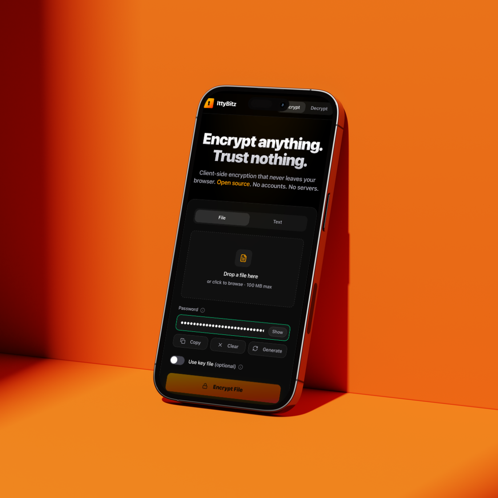

# 🔒 IttyBitz

<br/>

**Tired of worrying where your private files and notes end up?**

With this client-side encryption tool, you can lock down your sensitive information right in your browser—nothing ever leaves your device. 
Whether you’re protecting confidential work documents before sharing them, or storing personal notes you don’t want synced to the cloud, this tool makes security effortless.

IttyBitz offers a secure and private way to encrypt sensitive information directly in your browser without ever sending it to a server.

<p align=center>

</p>

<br/>

## ⚙️ Core features

Here’s what you can do with IttyBitz:
- **Client-side encryption/decryption**: all cryptographic operations happen in your browser. Your files and secrets are never sent to a server.
- **Password & key file protection**: secure your data with a strong password, an optional key file, or both for an added layer of security. You can use any existing file or generate a new, cryptographically secure key file directly within the app.
- **File & text support**: encrypt and decrypt both files and text snippets.
- **QR code sharing**: easily share encrypted text snippets via a downloadable QR code.
- **Hardware-wallet SeedQR export**: when decrypted text is a valid BIP-39 seed phrase, IttyBitz auto-detects it and can display a **Standard SeedQR** for direct import into hardware wallets (Coldcard, SeedSigner, Sparrow, Specter, Krux, Keystone, Jade). Any other decrypted text can be shown as a plain QR. Both are blurred until you deliberately reveal them.
- **Installable PWA with full offline support**: install IttyBitz to your home screen or desktop. After the first visit it works with zero network connectivity — ideal for air-gapped machines.
- **Privacy-focused UI**: the secret text field offers a show/hide blur toggle to prevent shoulder-surfing during input, and decrypted output is blurred by default until you tap to reveal.
- **Clipboard auto-clear**: copied passwords and output are wiped from the clipboard after 60 seconds (best-effort; requires the tab to retain focus).
- **Backward-compatible file format**: encrypted payloads include an `IBTZ` version header so the app can evolve without breaking old files. Anything encrypted with prior versions still decrypts identically.
- **No accounts required**: works entirely without user accounts or sign-ins.

<br/>

## 🥤 How to Use IttyBitz

At the top, you’ll find two simple tabs:  **Encrypt**  and **Decrypt**.

- In **Encrypt** mode, you can lock away a file or a text snippet with a password, a key file, or both.

| Encrypting a file | Encrypting text |
|---	|---	|
|	1.	Select the Encrypt tab.|	1.	Select the Encrypt tab.|   	
|	2.	Ensure the File option is selected.	|	2.	Choose the Text option.|
|	3.	Upload the file you wish to encrypt.|	3.	Enter your text in the provided box.|
|	4.	Enter a strong password. For extra security, toggle "Use Key File" to either select an existing file or generate and download a new one. |	4.	Enter a password. For extra security, toggle "Use Key File" to add a key file.|
|	5.	Click Encrypt and download the encrypted file for safekeeping.|	5.	After encrypting, you can copy the text, or click the **QR code icon** to view and download the encrypted output as a PNG file for easy, secure sharing.|

- In **Decrypt** mode, you simply unlock your protected content and get it back instantly—only if you hold the right key.

| Decrypting a file | Decrypting a text |
|---	|---	|
|	1.	Select the Decrypt tab.|	1.	Select the Decrypt tab.|   	
|	2.	Ensure the File option is selected.|	2.	Choose the Text option.|
|	3.	Upload the encrypted file.|		3.	Paste your encrypted text into the box.|
|	4.	Enter the same password (and the key file, if used) and click Decrypt.|		4.	Enter the password (and optional key file).|
|	5.	Download the decrypted file.|	5.	Copy the decrypted text output.|

<br/>

## 🛡️Security features

The security of your data is the highest priority. Here is a summary of the security measures built into IttyBitz:

- **Client-Side operations:** all encryption and decryption processes happen entirely within your browser. Your password, key files, and secret data are **never** transmitted over the internet or stored on any server.

- **Strong encryption standard:** IttyBitz uses **AES-256-GCM**, a modern authenticated encryption cipher that provides both confidentiality and data integrity.
- **Strong key derivation:** your password is not used directly as the encryption key. Instead, it is run through the **PBKDF2** (Password-Based Key Derivation Function 2) algorithm with **1,000,000 iterations**. This makes brute-force attacks against your password extremely slow and computationally expensive, even for weak passwords.
- **Cryptographically secure randomness:** the application uses `window.crypto.getRandomValues()` to generate the salt for key derivation, the Initialization Vector (IV) for AES-GCM, the random characters for the password generator, and the data for the key file generator. This is a cryptographically secure pseudo-random number generator (CSPRNG) that is suitable for security-sensitive applications.
- **Password strength indicator:** to encourage strong security practices, the UI provides real-time feedback, guiding users to create passwords that are at least 24 characters long and contain a mix of character types.
- **Best-effort memory clearing:** after an encryption or decryption operation is complete, the application overwrites sensitive variables (like the derived key and salt) in memory. Note: JavaScript's garbage collector may retain copies of data elsewhere in the heap, so this is a best-effort mitigation rather than a guarantee.
- **No user tracking:** the application does not use cookies, analytics, or trackers. Your activity is your own.

<br/>

## 🔬 Third-party validation

### **Independent security review**
This application has undergone a detailed security analysis. You can view the full report here: [Security analysis report](https://claude.ai/public/artifacts/f4bb6437-1130-4fd3-bc56-74b2399274f9) 🔗

The current audit findings and accepted tradeoffs are tracked in-repo: [SECURITY-AUDIT.md](SECURITY-AUDIT.md)

### **Open source advantage**
- **Transparent code**: every line of security code is publicly auditable
- **Community verified**: security experts worldwide can review our implementation
- **No hidden backdoors**: impossible to hide security vulnerabilities

### **Industry-standard algorithms**
- **FIPS-approved algorithms**: uses AES-256-GCM and PBKDF2-HMAC-SHA-256, which are approved under FIPS 140-2 (note: this app has not undergone formal FIPS certification)
- **Strong key derivation**: 1,000,000 PBKDF2 iterations to resist brute-force attacks
- **Privacy-focused design**: no accounts, no servers, no tracking — all operations stay in your browser

<br/>

## 📋 Release history

Every version, with what changed in each, is listed in the [**changelog**](CHANGELOG.md). Full notes per release live in [`docs/releases/`](docs/releases/).

Cryptography has never changed across any release — anything encrypted with any version of IttyBitz still decrypts today, and that guarantee is enforced automatically in CI against real ciphertexts from every prior release.

<br/>

## 📜 Licensing

IttyBitz is free software released under the [**GNU General Public License v3.0**](LICENSE).

You are free to use, modify, and distribute this software. Any derivative works must also be released under the GPLv3.

<br/>

## 💻  Ittybitz - Local Setup Instructions

For maximum security when handling sensitive data like seed phrases, you can run ittybitz locally on your own machine.

The build is pure JavaScript — there is no native compilation and no platform-specific build step, so the same four commands work on every OS. The sections below cover installing Node.js and serving the build on each platform.

### Prerequisites
- **Node.js 20.9 or newer** — check with `node --version`. See the per-OS install notes below.
- **Git** (or download the repository as a ZIP from GitHub).

### The four steps (all platforms)

```bash
git clone https://github.com/seQRets/ittybitz.git
cd ittybitz
npm install
npm run build
```

`npm run build` produces a fully static site in the `out/` directory. IttyBitz is a static export — there is no application server, so you just need any static file server to view it. Pick your platform below.

> **Note:** the production build is the recommended way to run locally, because the Content-Security-Policy is only applied to production builds. `npm run dev` (port 9002) is for development only.

---

<details open>
<summary><h3>🪟 Windows</h3></summary>

**Install Node.js**

Download the LTS installer from [nodejs.org](https://nodejs.org), or use a package manager:

```powershell
winget install OpenJS.NodeJS.LTS
```

Close and reopen your terminal afterwards so `PATH` updates.

**If `npm` won't run in PowerShell**

PowerShell blocks script execution by default, so `npm install` may fail with *"npm.ps1 cannot be loaded because running scripts is disabled on this system."* Either allow local scripts for your user:

```powershell
Set-ExecutionPolicy -Scope CurrentUser -ExecutionPolicy RemoteSigned
```

…or simply use **Command Prompt (cmd.exe)** or **Git Bash**, which are not affected.

**Run the four steps**, then serve the build:

```powershell
npx serve out -l 3000
```

**Python alternative** — note that on Windows the command is `python`, not `python3` (typing `python3` usually opens the Microsoft Store instead of running anything):

```powershell
python -m http.server 3000 -d out
```

Open **http://localhost:3000**, and press `Ctrl+C` in the terminal to stop.

**Using WSL?** Follow the Linux instructions instead, and open the URL in your normal Windows browser — WSL forwards `localhost` automatically.

</details>

<details open>
<summary><h3>🍎 macOS</h3></summary>

**Install Node.js**

Download the LTS installer from [nodejs.org](https://nodejs.org), or use [Homebrew](https://brew.sh):

```bash
brew install node
```

**Run the four steps**, then serve the build:

```bash
npx serve out -l 3000
```

**Python alternative** — macOS ships with Python 3, so no extra install is needed:

```bash
python3 -m http.server 3000 -d out
```

Open **http://localhost:3000**, and press `Ctrl+C` in the terminal to stop.

</details>

<details open>
<summary><h3>🐧 Linux</h3></summary>

**Install Node.js**

Distribution packages are often older than the required 20.9 — `apt install nodejs` on Debian/Ubuntu in particular may give you a version that fails the build. Check with `node --version` and, if it's too old, use [nvm](https://github.com/nvm-sh/nvm):

```bash
curl -o- https://raw.githubusercontent.com/nvm-sh/nvm/v0.40.1/install.sh | bash
# reopen your terminal, then:
nvm install --lts
```

Or use [NodeSource](https://github.com/nodesource/distributions) packages, or your distro's own current package (`dnf install nodejs`, `pacman -S nodejs npm`).

**Run the four steps**, then serve the build:

```bash
npx serve out -l 3000
```

**Python alternative** — present on essentially every distribution:

```bash
python3 -m http.server 3000 -d out
```

Open **http://localhost:3000**, and press `Ctrl+C` in the terminal to stop.

</details>

---

> **If port 3000 is already taken**, the `serve` command will quietly start on a different port — always use the URL it prints in the terminal. To pick your own port instead, change the number after `-l` (for example `npx serve out -l 8080`).

### Security Notes

- ✅ **Open Source**: All code is auditable and transparent
- ✅ **Offline Operation**: Works completely offline after initial setup
- ✅ **No External Dependencies**: All operations happen locally with no external network requests
- ✅ **Air-Gap Compatible**: Can be run on isolated machines

**For handling high-value secrets**, consider:
- Running on an air-gapped machine
- Auditing the source code before use
- Using the production build for better performance

### Troubleshooting

**1. Check your Node.js version** — must be 20.9 or newer:
```bash
node --version
```

**2. Clear dependencies and reinstall**

macOS / Linux:
```bash
rm -rf node_modules && npm install
```
Windows (PowerShell):
```powershell
Remove-Item -Recurse -Force node_modules; npm install
```

**3. Find what's using port 3000**

macOS / Linux:
```bash
lsof -ti:3000
```
Windows (PowerShell):
```powershell
Get-NetTCPConnection -LocalPort 3000 | Select-Object OwningProcess
```
You don't have to free the port — just serve on another one, e.g. `npx serve out -l 8080`.

**4. `npm` won't run in PowerShell** — see the execution-policy note in the Windows section above.

**5. `python3` opens the Microsoft Store** — on Windows the command is `python`, not `python3`.

<br/>

## ❤️ Support this project

If you find IttyBitz useful, please consider supporting its development. Your donation helps keep the project alive and ad-free.

**Donate:** [https://coinos.io/seQRets/receive](https://coinos.io/seQRets/receive)
